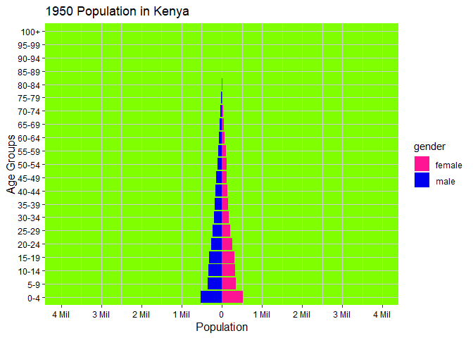

KENYA’S POPULATION GROWTH 1950 - 2020
================
Karanja David
16/12/2021

# ANALYSIS OF POPULATION GROWTH IN KENYA

## setting up the enviroment

loading packages

``` r
library(animation)
library(gganimate)
library(janitor)
library(lubridate)
library(tidyverse)
library(wpp2019)
```

## load data sets

``` r
#load data from wpp2019 package
data(popF)
data(popM)
```

## explore data sets

``` r
#popF contains female population while popM contains male population.
str(popF)
```

    ## 'data.frame':    5229 obs. of  18 variables:
    ##  $ country_code: int  900 900 900 900 900 900 900 900 900 900 ...
    ##  $ name        : chr  "World" "World" "World" "World" ...
    ##  $ age         : chr  "0-4" "5-9" "10-14" "15-19" ...
    ##  $ 1950        : num  166077 131785 127343 117333 109689 ...
    ##  $ 1955        : num  199236 154926 128616 124828 114283 ...
    ##  $ 1960        : num  212402 187553 151840 126068 122023 ...
    ##  $ 1965        : num  234318 200959 183750 149282 123584 ...
    ##  $ 1970        : num  256787 224556 198212 181377 146959 ...
    ##  $ 1975        : num  266221 247279 221764 195801 178776 ...
    ##  $ 1980        : num  267434 257559 244682 219852 193518 ...
    ##  $ 1985        : num  287731 259928 255382 242940 217743 ...
    ##  $ 1990        : num  312905 280584 258206 253753 240489 ...
    ##  $ 1995        : num  300117 306503 279136 256440 250736 ...
    ##  $ 2000        : num  297524 294721 304908 277326 253615 ...
    ##  $ 2005        : num  302684 293423 293769 302955 274399 ...
    ##  $ 2010        : num  314830 298887 292351 291785 299587 ...
    ##  $ 2015        : num  324426 311370 297197 290910 290007 ...
    ##  $ 2020        : num  328509 321512 309770 295554 289101 ...

``` r
str(popM)
```

    ## 'data.frame':    5229 obs. of  18 variables:
    ##  $ country_code: int  900 900 900 900 900 900 900 900 900 900 ...
    ##  $ name        : chr  "World" "World" "World" "World" ...
    ##  $ age         : chr  "0-4" "5-9" "10-14" "15-19" ...
    ##  $ 1950        : num  172420 138298 133686 122155 113207 ...
    ##  $ 1955        : num  207941 161087 134817 130542 118354 ...
    ##  $ 1960        : num  221606 196203 158035 131917 126961 ...
    ##  $ 1965        : num  244985 210104 192262 155046 128692 ...
    ##  $ 1970        : num  267293 234848 207446 189471 151513 ...
    ##  $ 1975        : num  278289 257638 231924 204456 186012 ...
    ##  $ 1980        : num  280164 269790 255353 229895 201553 ...
    ##  $ 1985        : num  302397 272585 267331 253189 226726 ...
    ##  $ 1990        : num  330649 295190 270567 265117 249684 ...
    ##  $ 1995        : num  319726 323931 293461 267996 260565 ...
    ##  $ 2000        : num  318141 314049 321975 290819 263671 ...
    ##  $ 2005        : num  324554 313764 312860 319208 286149 ...
    ##  $ 2010        : num  337184 320668 312621 310243 314102 ...
    ##  $ 2015        : num  346247 333336 318749 310734 307555 ...
    ##  $ 2020        : num  349433 342928 331497 316642 308287 ...

## Transform the data

### Kenya’s female population

Country names are derived from country codes specified in the link
[codes](https://en.wikipedia.org/wiki/ISO_3166-1_numeric)

``` r
# Country of interest - Kenya code 404.

#Kenya's Female population
pop_female_kenya <- popF %>%
  gather(Year, popF, '1950'|'1955'|'1960'|'1965'|'1970'|'1975'
         |'1980'|'1985'|'1990'|'1995'|'2000'|'2005'
         |'2010'|'2015'|'2020') %>%
  clean_names() %>% 
  rename(pop_in_thousands = pop_f, country = name) %>% 
  filter(country_code %in% c(404)) %>%
  select(country, age, year, pop_in_thousands) 

#add a gender column
pop_female_kenya$gender <- "female"

#view a sample of the new data frame
head(pop_female_kenya)
```

    ##   country   age year pop_in_thousands gender
    ## 1   Kenya   0-4 1950          526.128 female
    ## 2   Kenya   5-9 1950          352.595 female
    ## 3   Kenya 10-14 1950          326.793 female
    ## 4   Kenya 15-19 1950          306.908 female
    ## 5   Kenya 20-24 1950          254.819 female
    ## 6   Kenya 25-29 1950          207.579 female

### Kenya’s male population

``` r
#Kenya's Male population
pop_male_kenya <- popM %>%
  gather(Year, popM, '1950'|'1955'|'1960'|'1965'|'1970'|'1975'
         |'1980'|'1985'|'1990'|'1995'|'2000'|'2005'
         |'2010'|'2015'|'2020') %>%
  clean_names() %>% 
  rename(pop_in_thousands = pop_m, country = name) %>% 
  filter(country_code %in% c(404)) %>%
  select(country, age, year, pop_in_thousands) 

#add a gender column
pop_male_kenya$gender <- "male"

#view a sample of the new data frame
head(pop_male_kenya)
```

    ##   country   age year pop_in_thousands gender
    ## 1   Kenya   0-4 1950          530.104   male
    ## 2   Kenya   5-9 1950          354.147   male
    ## 3   Kenya 10-14 1950          326.986   male
    ## 4   Kenya 15-19 1950          316.221   male
    ## 5   Kenya 20-24 1950          271.601   male
    ## 6   Kenya 25-29 1950          230.666   male

### Combine male and female data frames

``` r
#ensure consistency of column names and corresponding data types
#combine male and female population
total_pop <- rbind(pop_female_kenya, pop_male_kenya)
```

## Clean the data types

### 1. age: character to factor

``` r
#1) age to factor
total_pop$age <- factor(total_pop$age, levels = c("0-4", "5-9", "10-14", 
                                                  "15-19", "20-24", "25-29",
                                                  "30-34", "35-39", "40-44",
                                                  "45-49", "50-54", "55-59",
                                                  "60-64", "65-69", "70-74",
                                                  "75-79", "80-84", "85-89",
                                                  "90-94", "95-99", "100+"),
                        order = TRUE)
```

### 2. gender: character to factor

``` r
#2)gender to factor
total_pop$gender <- factor(total_pop$gender) 
```

### 3. year: character to date to numeric

``` r
#3) year to numeric
total_pop$year <- as.Date(total_pop$year, "%Y")

total_pop$year <- year(total_pop$year)
```

### View structure of the transformed total_pop data frame

``` r
#view the correct data types 
str(total_pop)
```

    ## 'data.frame':    630 obs. of  5 variables:
    ##  $ country         : chr  "Kenya" "Kenya" "Kenya" "Kenya" ...
    ##  $ age             : Ord.factor w/ 21 levels "0-4"<"5-9"<"10-14"<..: 1 2 3 4 5 6 7 8 9 10 ...
    ##  $ year            : num  1950 1950 1950 1950 1950 1950 1950 1950 1950 1950 ...
    ##  $ pop_in_thousands: num  526 353 327 307 255 ...
    ##  $ gender          : Factor w/ 2 levels "female","male": 1 1 1 1 1 1 1 1 1 1 ...

## plot Kenya’s 2020 population distribution

``` r
#Prepare the data

kenya_population <- total_pop %>%
  mutate(pop = pop_in_thousands * 1000,
         population = ifelse(gender == "female", 1, -1)*pop)


#plot Kenya's population distribution between male and female in 2020

kenya_population_plot <- kenya_population %>% 
  filter(year == 2020) %>% 
  ggplot(aes(x = age, y = population, fill = gender))+ 
  geom_bar(stat="identity") +
  scale_y_continuous(breaks=seq(-4000000, 4000000, 1000000),
                     labels =c('4 Mil','3 Mil','2 Mil', '1 Mil',
                               '0','1 Mil','2 Mil','3 Mil', '4 Mil'),
                     limits = c(-4000000, 4000000)) +
  xlab("Age Groups") +
  coord_flip() +
  
  labs(title ='Population in Kenya in 2020') +
  scale_fill_manual(values=c('deeppink1', 'navy blue'))+
  theme(plot.background = element_rect(fill = "limegreen", 
                                       color = NA),
        panel.background = element_rect(fill = "limegreen"),
        axis.text = element_text(color = "white"),
        axis.title = element_text(color = "white", size = 12),
        plot.title = element_text(color = "white"),
        # plot.margin = unit(c(2,1.5,1,1), "cm"),
        panel.grid = element_line(color = "#4d4d4d"))

  
 kenya_population_plot
```

<!-- -->

## gif showing population distribution since 1950

``` r
#visualize the data over the years in a gif
 
 kenya_population_gif <- ggplot(data = kenya_population,
                 aes(x = age, y = population, fill = gender))+
   geom_bar(stat='identity') + 
   scale_y_continuous(breaks=seq(-4000000, 4000000, 1000000),
                      labels =c('4 Mil','3 Mil','2 Mil', '1 Mil',
                                '0','1 Mil','2 Mil','3 Mil', '4 Mil'),
                      limits = c(-4000000, 4000000)) +
   xlab("Age Groups") + 
   ylab("Population") +  
   coord_flip() + 
   labs(fill = "gender") +
   scale_fill_manual(values=c('deeppink1', 'blue2')) +
   #theme_bw()+
   theme(plot.background = element_rect(fill = "white", color = NA),
         panel.background = element_rect(fill = "chartreuse"),
         axis.text = element_text(color = "black"),
         axis.title = element_text(color = "black", size = 12),
         plot.title = element_text(color = "black"),
         panel.grid = element_line(color = "grey80")) + 
   transition_time(year) +
   labs(title = "{as.integer(frame_time)} Population in Kenya")

 
kenya_population_gif
```

<!-- -->
